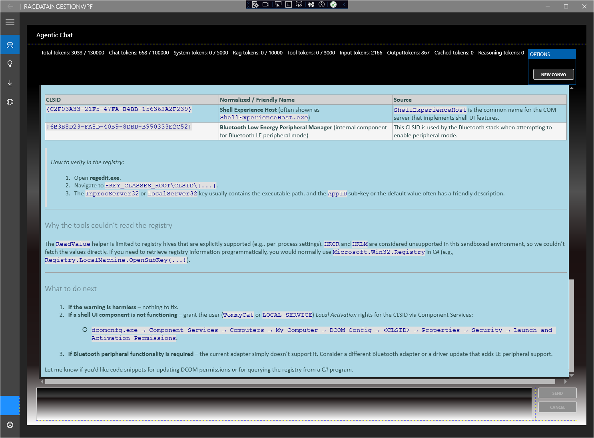

---

name: README.md
description: README for RAGDataIngestionWPF repository
updated: 2026-04-02

---

Last Update: 4/2/2026

# RAGDataIngestionWPF

A WPF desktop application and supporting libraries demonstrates creating Agentic AI's with Microsoft's Agent Framework using local models, including tool function calling. The current implementation includes a SQL Server-based chat history provider and context enhancement injectors that can leverage new SQL Server 2025 features for vector search and vector embeddings to enhance the context retrieval capabilities. The project is designed to be extensible and adaptable, allowing for different configurations of context management and retrieval strategies as needed. Agent tools are designed as individual sets of functions Readonly diagnostic tools, and a set of more powerful tools that can modify the system state. The powerful tools are gated behind configuration settings and clearly marked in the UI to prevent accidental use, and the repository includes documentation and comments to highlight the potential risks associated with these tools.

**Hard limit to .Net10 by design to target Windows 10 at minimum.**

*Status: active development. The current solution targets .NET 10 Windows TFMs and `DataIngestionLib` currently references Microsoft Agent Framework `1.0.0-rc4` packages.*

Project is not cross-platform nor intended to be. The focus is Agentic AI diagnostics of Windows systems, Windows 0 and above.

---

---

## Table of Contents

- [Project Purpose](#project-purpose)
- [Quick Start - Without SQL](#quick-start)
- [Experimental Features](#experimental-features)
- [Documentation](#documentation)
- [Solution Structure](#solution-structure)
- [Current Implementation Highlights](#current-implementation-highlights)
- [Technology Stack](#technology-stack)
- [SQL Server 2025 Dependency](#sql-server-2025-dependency)
- [Prerequisites](#prerequisites)
- [Getting Started](#getting-started)
- [Configuration](#configuration)
- [Running Tests](#running-tests)

## Project Purpose

`RAGDataIngestionWPF` currently contains:

- a WPF composition root in `src/RAGDataIngestionWPF`
- a UI-agnostic agent, ingestion, history, and tool library in `src/DataIngestionLib`
- shared UI infrastructure in `src/RAGDataIngestionWPF.Core`
- an MSTest suite in `tests/RAGDataIngestionWPF.Tests.MSTest`

## Quick Start

This project has gated features and experimental attributes enforcing the acknowledgement of potentially unreliable results or destructive tool functions. To get started with the core agent read the section on experimental features in this document.[Experimental Features](#experimental-features)

## Documentation

The `docs` folder currently contains these developer-facing entry points:

- [`/docs/DocumentationManifest.md`](/docs/DocumentationManifest.md) - index of maintained documentation
- [`/docs/Architecture.md`](/docs/Architecture.md) - high-level solution and layering overview
- [`/docs/Components.md`](/docs/Components.md) - component inventory across the solution
- [`/docs/ContextManagement.md`](/docs/ContextManagement.md) - context, history, and RAG state model
- [`/docs/ChangeLog.md`](/docs/ChangeLog.md) - narrative change log for notable repository updates
- [`/docs/RAG Search Strategy.md`](/docs/RAG%20Search%20Strategy.md) - repository notes about retrieval strategy

The `sql` folder contains SQL scripts used to set up the database components of the solution, including stored procedures, triggers, and table definitions.

- [`/sql/README.md`](/sql/README.md) - important notes on SQL database dependencies, setup, and configuration for the project

Start with the manifest if you want the quickest route to the right document.

## Experimental Features

This repository includes features that are in active development and may produce unreliable results or have destructive capabilities. These features are gated behind clearly marked constants and configuration settings to prevent accidental use. When working with or testing these features, please review the relevant documentation and code comments to understand the potential risks and limitations.

| Diagnostic Code | Description | Location |
| --- | --- | --- |
| KC00101 | Method uses preview features of SQL Server 2025 and has produced unreliable results in some test runs. Cause: VECTOR_DISTANCE - Workaround has not yet been discovered, Exception references score column but documentation states it was removed and Stored Proc does not use it. Suspected reaction to unexpected floats in embeddings either in sql source or generated.| AIContextRAGInjector.cs  |
| --- | --- | --- |

## Solution Structure

```text
RAGDataIngestionWPF/
├── docs/                               # Developer-facing documentation
├── src/
│   ├── RAGDataIngestionWPF/            # WPF application and composition root
│   ├── DataIngestionLib/               # Agent, RAG, ingestion, and tool library
│   └── RAGDataIngestionWPF.Core/       # Shared UI infrastructure
├── tests/
│   └── RAGDataIngestionWPF.Tests.MSTest/  # MSTest unit and integration coverage
└── SolutionFix/                        # A no-op project to fix Solution Explorer - Maintains proper visual of solution structure without affecting build or dependencies
```

### Current Projects

| Project | Current role |
| --- | --- |
| `src/RAGDataIngestionWPF` | WPF app, host startup, views, view models, navigation, theming, and application orchestration |
| `src/DataIngestionLib` | AI agent composition, contracts, services, providers, ingestion workflows, models, and agent-visible tools |
| `src/RAGDataIngestionWPF.Core` | Shared UI-supporting contracts, helpers, models, and services |
| `tests/RAGDataIngestionWPF.Tests.MSTest` | MSTest coverage for library, UI-supporting services, and integration slices |

## Current Implementation Highlights

The repository currently includes the following observable implementation areas:

- WPF host composition in `src/RAGDataIngestionWPF/App.xaml.cs`
- agent orchestration and chat services under `src/DataIngestionLib/Agents` and `src/DataIngestionLib/Services`
- contracts and service seams under `src/DataIngestionLib/Contracts`
- ingestion and provider code under `src/DataIngestionLib/DocIngestion`, `src/DataIngestionLib/Providers`, and related folders
- staged retrieval/search strategy in `src/DataIngestionLib/Providers/SqlChatHistoryProvider.cs`: broad full-text retrieval first, BM25-based concentration/ranking next, and semantic vector-similarity refinement when vector matches are available
- read-only agent tool registration through `src/DataIngestionLib/ToolFunctions/ToolBuilder.cs`
- a Windows diagnostics tool set that currently includes file read, web search, system info, event log access, event channel access, registry reads, WMI reads, service health, startup inventory, storage health, network configuration, process snapshots, performance counters, reliability history, installed updates, and a bounded command runner
- MSTest coverage for unit, boundary, host, UI-supporting, and integration scenarios in `tests/RAGDataIngestionWPF.Tests.MSTest`

## Technology Stack

| Component | Package / Version |
| --- | --- |
| AI Agent Framework | `Microsoft.Agents.AI` 1.0.0-rc4 |
| Agent Builder | `Microsoft.Agents.Builder` 1.5.60-beta |
| AI Abstractions | `Microsoft.Extensions.AI` 10.4.1 |
| LLM Provider | [OllamaSharp](https://github.com/awaescher/OllamaSharp) 5.4.24 |
| ORM | EF Core 10.0.3 (`Microsoft.EntityFrameworkCore.SqlServer`) |
| Database integrations | SQL Server-oriented history and retrieval components in `DataIngestionLib` |
| UI Framework | WPF on .NET 10 Preview |
| UI Theming | MahApps.Metro 3.0.0-rc0529 |
| Hosting / logging | Microsoft.Extensions.Hosting 10.0.5 |
| MVVM Toolkit | CommunityToolkit.Mvvm 8.4.0 |
| Notifications | Microsoft.Toolkit.Uwp.Notifications 7.1.3 |
| Testing | MSTest 4.1.0 + Moq 4.20.72 |

## SQL Server 2025 Dependency

Out of the Box (OOB) this repository includes a defined constant 'SQL' that gates features with SQL Server dependencies. REMOVE this constant from the UI project and the DataIngestionLib project to allow the solution to build and run without SQL Server, using in-memory implementations for chat history and retrieval instead. For the full experience including chat history and RAG context management, SQL Server 2025 is required.

## Prerequisites

- Windows 10 or 11
- .NET 10 Preview SDK
- Visual Studio 2022 or Visual Studio Preview with .NET desktop tooling if you want to run the WPF app interactively
- Ollama if you want to exercise the local chat model settings in the app
- SQL Server if you want to exercise chat history or related database-backed features
- local Windows access for the Windows diagnostics tools and integration tests

## Getting Started

### 1. Clone the repository

```bash
git clone https://github.com/KyleC69/RAGDataIngestionWPF.git
cd RAGDataIngestionWPF
```

### 2. Build the main projects

```bash
dotnet build src/DataIngestionLib/DataIngestionLib.csproj
dotnet build src/RAGDataIngestionWPF/RAGDataIngestionWPF.csproj
```

### 3. Open the solution

Open `RAGDataIngestionWPF.slnx` in Visual Studio if you want to run or debug the WPF application.

### 4. Configure local settings as needed

The app currently ships with `src/RAGDataIngestionWPF/App.config` and generated settings files under `src/RAGDataIngestionWPF/Properties`.
Machine-specific values such as model selection, host information, and database connection strings should be supplied through local settings rather than committed repository edits.

Key settings visible in `App.config` include:

- `OllamaHost`
- `OllamaPort`
- `ChatModel`
- `EmbeddingModel`
- `ChatHistoryConnectionString`
- `RemoteRAGConnectionString`

## Configuration

Configuration is currently split across:

- `src/RAGDataIngestionWPF/App.config`
- `src/RAGDataIngestionWPF/Properties/Settings.settings`
- machine-local user settings generated by the .NET settings infrastructure

The repository does not currently expose an `appsettings.json`-based configuration story at the root README level. When updating settings-backed behavior, inspect the WPF project's settings files and the code paths that consume them.

### Environment Variables

| Variable | Required | Description |
| --- | --- | --- |
| `LANGAPI_KEY` | Optional | API key used by the web-search tool |

## Running Tests

Run the full MSTest project with:

```cmd
dotnet test tests/RAGDataIngestionWPF.Tests.MSTest/RAGDataIngestionWPF.Tests.MSTest.csproj
```

The test project currently includes:

- broad unit coverage across conversation services, providers, models, view-model support code, and tool functions
- focused boundary tests for the Windows diagnostics tools
- integration-tagged diagnostics suites

Run only the integration-tagged tests with:

```cmd

dotnet test tests/RAGDataIngestionWPF.Tests.MSTest/RAGDataIngestionWPF.Tests.MSTest.csproj --filter "TestCategory=Integration"
```

## Changelog

See [ChangeLog](CHANGELOG.md) for a detailed list of changes and updates to the project.

## Feedback

Bugs and feature requests should be filed at [Issues · KyleC69/RAGDataIngestionWPF](https://github.com/KyleC69/RAGDataIngestionWPF/issues)
