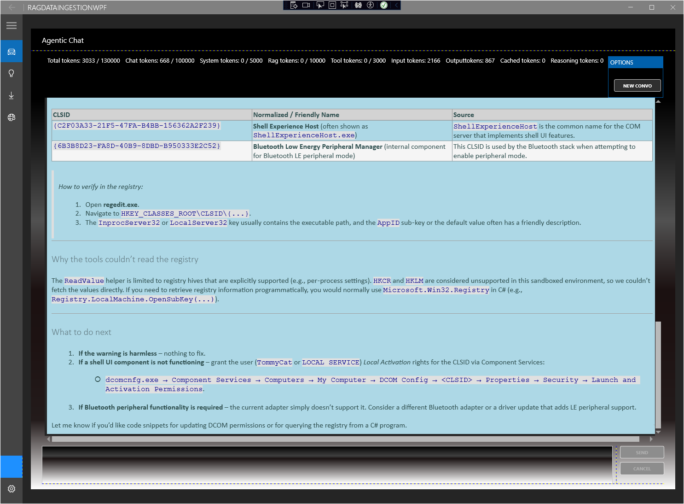

# Agentic-AI-WPF

**STATUS:** I am currently replacing ad-hoc routines with the new Agent Framework patterns and features. This project was started before the framework was completed and patterns developed. I am looking for a few volunteers to help with the UI work on this project and the new next-generation agentic project codename: SentinelCore. If you are interested in contributing to either project please reach out to me on GitHub or email me directly at <kcrowdergoog@gmail.com>. I am also looking for feedback on the current implementation, I will continue to fix any bugs in this version but new features will not be added without some justification.

The next evolution of this project is the SentinelCore project featuring agent swarms and dynamic agent generation.

Last Update: 5/22/2026

## Introduction

This is a WPF desktop application and chat library demonstrating the versatility and power of Microsoft's Agent Framework. The framework is desinged to be lightweight, but the flexibilty in agent creation and orchestration makes this extremely powerfull. Some of the features demonstrated here include SQL Server backed chat history, Context enrichment through middleware. I am using ollama as the inference provider and use both local models or cloud based with a control in the UI to select a different model for every task round. I have also tested preview model capabilities in Sql Server with fantastic results. I sent the model calls from SQL to reverse proxy, to ollama client on different machine and off to the model. Current features in SQL are small but the possibilities are very promising.

The default agent was designed to be a Windows System expert to identify and investigate system anomalies. During development of this application I implemented a domain specific RAG injector tied directly to the MAF repo to keep my coding agents grounded to the actual framework surface as it was being developed. Documentation and samples were non-existant, it was the only way to keep current on every change being made. That AIContext enricher is not included in this repo, it is out of the scope of this project, it evolved into a beastly data ingestion store with semantic/temporal tracking layers and on the fly Roslyn AST generation. But it does highlight the raw power that the framework has when applied with a bit of imagination and purpose.

This project can be easily adapted to be proactive and monitor a system for alerts from any subsytem. It could also be used inline as an investigator before alerting an administrator as needed. The possibilities are immense. The tools are sets of readonly specifically targeted diagnostic tools, with a few more powerful tools that can modify the system state.

**Warning** DO NOT enable potentially destructive tools without understanding the risks involved. This system lacks many of the safegaurds and recovery options built into mainstream AI Assistants. Use at your own risk, I accept no responsibility for stupidity.

---



## Table of Contents

- [Project Purpose](#project-purpose)
- [Quick Start - Without SQL](#quick-start)
- [Experimental Features](#experimental-features)
- [Documentation](#documentation)
- [Solution Structure](#solution-structure)
- [Current Implementation Highlights](#current-implementation-highlights)
- [Technology Stack](#technology-stack)
- [SQL Server 2025 Dependency](#sql-server-2025-dependency)
- [Prerequisites](#prerequisites)
- [Getting Started](#getting-started)
- [Configuration](#configuration)
- [Running Tests](#running-tests)

## Project Purpose

`AgenticAIWPF` is currently purposed as a Windows Operating System investigation tool and features:

- A WPF composition root in `src/AgenticAIWPF`
- A UI-agnostic agent, enrichment, history, and tool library in `src/AgentAILib`
- Shared UI infrastructure in `src/AgenticAIWPF.Core`
- MSTest suite in `tests/AgenticAIWPF.Tests.MSTest`

## Quick Start

This project has gated features that are enable/disabled with an environment variable. Ensure you are in the correct mode before running application. I have added experimental attributes enforcing the acknowledgement of potentially unreliable results or destructive tool functions. To get started with the core agent read the section on experimental features in this document.[Experimental Features](#experimental-features)

## Documentation

The `docs` folder currently contains these developer-facing entry points:

- [`/docs/DocumentationManifest.md`](/docs/DocumentationManifest.md) - index of maintained documentation
- [`/docs/Architecture.md`](/docs/Architecture.md) - high-level solution and layering overview
- [`/docs/Components.md`](/docs/Components.md) - component inventory across the solution
- [`/docs/ContextManagement.md`](/docs/ContextManagement.md) - context, history, and RAG state model
- [`/docs/ChangeLog.md`](/docs/ChangeLog.md) - narrative change log for notable repository updates

The `sql` folder contains SQL scripts used to set up the database components of the solution, including stored procedures, triggers, and table definitions.

- [`/sql/README.md`](/sql/README.md) - important notes on SQL database dependencies, setup, and configuration for the project

Start with the manifest if you want the quickest route to the right document.

## Experimental Features

This repository includes features that are in active development and may produce unreliable results or have destructive capabilities. These features are gated behind clearly marked constants and configuration settings to prevent accidental use. When working with or testing these features, please review the relevant documentation and code comments to understand the potential risks and limitations.

| Diagnostic Code | Description                                     | Location                |
| --------------- | ----------------------------------------------- | ----------------------- |
| KC00101         | Method uses preview features of SQL Server 2025 | AIContextRAGInjector.cs |

## Solution Structure

```text
AgenticAIWPF/
├── docs/                               # Developer-facing documentation
├── src/
│   ├── AgenticAIWPF/            # WPF application and composition root
│   ├── AgentAILib/               # Agent, RAG, ingestion, and tool library
│   └── AgenticAIWPF.Core/       # Shared UI infrastructure
├── tests/
│   └── AgenticAIWPF.Tests.MSTest/  # MSTest unit and integration coverage
└── SolutionFix/                        # A no-op project to fix Solution Explorer - Maintains proper visual of solution structure without affecting build or dependencies
```

### Current Projects

| Project                           | Current role                                                                                               |
| --------------------------------- | ---------------------------------------------------------------------------------------------------------- |
| `src/AgenticAIWPF`                | WPF app, host startup, views, view models, navigation, theming, and application orchestration              |
| `src/AgentAILib`                  | AI agent composition, contracts, services, providers, ingestion workflows, models, and agent-visible tools |
| `src/AgenticAIWPF.Core`           | Shared UI-supporting contracts, helpers, models, and services                                              |
| `tests/AgenticAIWPF.Tests.MSTest` | MSTest coverage for library, UI-supporting services, and integration slices                                |

## Current Implementation Highlights

The repository currently includes the following observable implementation areas:

- WPF host composition in `src/AgenticAIWPF/App.xaml.cs`
- agent orchestration and chat services under `src/AgentAILib/Agents` and `src/AgentAILib/Services`
- contracts and service seams under `src/AgentAILib/Contracts`
- ingestion and provider code under `src/AgentAILib/DocIngestion`, `src/AgentAILib/Providers`, and related folders
- staged retrieval/search strategy in `src/AgentAILib/Providers/SqlChatHistoryProvider.cs`: broad full-text retrieval first, BM25-based concentration/ranking next, and semantic vector-similarity refinement when vector matches are available
- read-only agent tool registration through `src/AgentAILib/ToolFunctions/ToolBuilder.cs`
- a Windows diagnostics tool set that currently includes file read, web search, system info, event log access, event channel access, registry reads, WMI reads, service health, startup inventory, storage health, network configuration, process snapshots, performance counters, reliability history, installed updates, and a bounded command runner
- MSTest coverage for unit, boundary, host, UI-supporting, and integration scenarios in `tests/AgenticAIWPF.Tests.MSTest`

## Technology Stack

| Component             | Package / Version                                                    |
| --------------------- | -------------------------------------------------------------------- |
| AI Agent Framework    | `Microsoft.Agents.AI` 1.0.0                                          |
| Agent Builder         | `Microsoft.Agents.Builder` 1.5.60-beta                               |
| AI Abstractions       | `Microsoft.Extensions.AI` 10.4.1                                     |
| LLM Provider          | [OllamaSharp](https://github.com/awaescher/OllamaSharp) 5.4.24       |
| ORM                   | EF Core 10.0.3 (`Microsoft.EntityFrameworkCore.SqlServer`)           |
| Database integrations | SQL Server-oriented history and retrieval components in `AgentAILib` |
| UI Framework          | WPF on .NET 10 Preview                                               |
| UI Theming            | MahApps.Metro 3.0.0-rc0529                                           |
| Hosting / logging     | Microsoft.Extensions.Hosting 10.0.5                                  |
| MVVM Toolkit          | CommunityToolkit.Mvvm 8.4.0                                          |
| Notifications         | Microsoft.Toolkit.Uwp.Notifications 7.1.3                            |
| Testing               | MSTest 4.1.0 + Moq 4.20.72                                           |

## SQL Server 2025 Dependency

Out of the Box (OOB) this repository includes a defined constant 'SQL' that gates features with SQL Server dependencies. REMOVE this constant from the UI project and the AgentAILib project to allow the solution to build and run without SQL Server, using in-memory implementations for chat history and retrieval instead. For the full experience including chat history and RAG context management, SQL Server 2025 is required.

## Prerequisites

- Windows 10 or 11
- .NET 10 Preview SDK
- Visual Studio 2022 or Visual Studio Preview with .NET desktop tooling if you want to run the WPF app interactively
- Ollama if you want to exercise the local chat model settings in the app
- SQL Server if you want to exercise chat history or related database-backed features
- local Windows access for the Windows diagnostics tools and integration tests

## Getting Started

### 1. Clone the repository

```bash
git clone https://github.com/KyleC69/AgenticAIWPF.git
cd AgenticAIWPF
```

### 2. Build the main projects

```bash
dotnet build src/AgentAILib/AgentAILib.csproj
dotnet build src/AgenticAIWPF/AgenticAIWPF.csproj
```

### 3. Open the solution

Open `AgenticAIWPF.slnx` in Visual Studio if you want to run or debug the WPF application.

### 4. Configure local settings as needed

The app currently ships with `src/AgenticAIWPF/App.config` and generated settings files under `src/AgenticAIWPF/Properties`.
Machine-specific values such as model selection, host information, and database connection strings should be supplied through local settings rather than committed repository edits.

Key settings visible in `App.config` include:

- `OllamaHost`
- `OllamaPort`
- `ChatModel`
- `EmbeddingModel`
- `ChatHistoryConnectionString`
- `RemoteRAGConnectionString`

## Configuration

Configuration is currently split across:

- `src/AgenticAIWPF/App.config`
- `src/AgenticAIWPF/Properties/Settings.settings`
- machine-local user settings generated by the .NET settings infrastructure

The repository does not currently expose an `appsettings.json`-based configuration story at the root README level. When updating settings-backed behavior, inspect the WPF project's settings files and the code paths that consume them.

### Environment Variables

| Variable      | Required | Description                         |
| ------------- | -------- | ----------------------------------- |
| `LANGAPI_KEY` | Optional | API key used by the web-search tool |

## Running Tests

Run the full MSTest project with:

```cmd
dotnet test tests/AgenticAIWPF.Tests.MSTest/AgenticAIWPF.Tests.MSTest.csproj
```

The test project currently includes:

- broad unit coverage across conversation services, providers, models, view-model support code, and tool functions
- focused boundary tests for the Windows diagnostics tools
- integration-tagged diagnostics suites

Run only the integration-tagged tests with:

```cmd

dotnet test tests/AgenticAIWPF.Tests.MSTest/AgenticAIWPF.Tests.MSTest.csproj --filter "TestCategory=Integration"
```

## Feedback

Bugs and feature requests should be filed at [Issues · KyleC69/AgenticAIWPF](https://github.com/KyleC69/AgenticAIWPF/issues)
